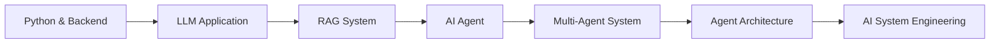

````markdown
<!-- ==================== Header ==================== -->

<div align="center">


<br/>

<a href="https://github.com/HeHaojie-Agent">
  
</a>
<a href="https://github.com/HeHaojie-Agent?tab=repositories">
  
</a>
<a href="mailto:2653528729@qq.com">
  
</a>

</div>

---

<!-- ==================== Introduction ==================== -->

## 👨‍💻 About Me

```python
class HeHaojie:

    def __init__(self):
        self.name = "He Haojie"
        self.role = "AI Agent Developer"
        self.education = "Tianjin University of Science and Technology"
        self.major = "Internet of Things Engineering"

        self.interests = [
            "AI Agent",
            "Large Language Models",
            "Retrieval-Augmented Generation",
            "Multi-Agent Systems",
            "Intelligent Workflow"
        ]

    def current_focus(self):
        return [
            "Building practical AI Agent applications",
            "Exploring RAG retrieval and reranking",
            "Designing multi-agent collaboration workflows",
            "Improving AI engineering capabilities"
        ]
````

<table>
<tr>
<td width="50%" valign="top">

### 🧠 Cyber Profile

* 🎓 Studying at **TUST**
* 🤖 Focused on **AI Agent Development**
* 📚 Exploring **RAG and Knowledge Systems**
* 🔄 Building **Agentic Workflows**
* 🧪 Researching **LLM Applications**
* 🏆 Participating in competitions and research projects

</td>
<td width="50%" valign="top">

### 🚀 Current Focus

* Multi-Agent collaboration systems
* Domain-specific intelligent Q&A
* RAG retrieval and reranking
* LangGraph workflow orchestration
* FastAPI AI application deployment
* LLM application engineering

</td>
</tr>
</table>

---

<!-- ==================== Technology Stack ==================== -->

## 🛠️ Technology Arsenal

<div align="center">

### Programming & Development


<br/><br/>

### AI Agent & LLM Frameworks


<br/>


<br/><br/>

### Data, Retrieval & Deployment


</div>

---

<!-- ==================== Research Interests ==================== -->

## 🔬 Research & Development Interests

<div align="center">

|           Direction          | Current Exploration                                                |
| :--------------------------: | :----------------------------------------------------------------- |
|        🤖 **AI Agent**       | Tool calling, memory, planning and autonomous task execution       |
|   🔄 **Multi-Agent System**  | Agent collaboration, role assignment and workflow orchestration    |
|          📚 **RAG**          | Retrieval, reranking, knowledge grounding and answer generation    |
| 🧠 **Large Language Models** | Prompt engineering, fine-tuning and model application              |
|     ⚙️ **AI Engineering**    | FastAPI services, databases, deployment and system architecture    |
| 📊 **Mathematical Modeling** | Statistical modeling, optimization and data-driven decision-making |

</div>

---

<!-- ==================== Featured Projects ==================== -->

## 🔥 Featured Projects

<table>
<tr>
<td width="50%" valign="top">

### 🤖 Multi-Agent Collaboration System

A multi-agent collaboration framework designed around role assignment, task planning and autonomous execution.

**Core Functions**

* Multi-agent task decomposition
* Agent communication and collaboration
* Tool calling and workflow control
* Task status tracking

**Technology**

`Python` `AutoGen` `LangGraph` `FastAPI`

</td>
<td width="50%" valign="top">

### 📚 Intelligent Knowledge Base

A knowledge question-answering system combining document retrieval, semantic search, reranking and large language models.

**Core Functions**

* Document parsing and chunking
* Vector retrieval
* Evidence reranking
* Knowledge-grounded generation

**Technology**

`RAG` `LangChain` `FAISS` `Qwen`

</td>
</tr>

<tr>
<td width="50%" valign="top">

### 🔄 Agent Workflow Engine

A controllable AI workflow system based on graph orchestration for complex and multi-step tasks.

**Core Functions**

* Workflow state management
* Conditional routing
* Human-in-the-loop interaction
* Failure recovery and retry

**Technology**

`LangGraph` `Python` `FastAPI` `Redis`

</td>
<td width="50%" valign="top">

### 🧪 RAG Reranking Research

Exploring lightweight evidence reranking and knowledge retrieval optimization for domain-specific question-answering systems.

**Core Functions**

* Candidate document retrieval
* Hard-negative sample construction
* Teacher-student distillation
* Hybrid reranking evaluation

**Technology**

`PyTorch` `Transformers` `RoBERTa` `Qwen`

</td>
</tr>
</table>

> 🚧 More repositories and project demonstrations are being organized and will be released gradually.

---

<!-- ==================== GitHub Stats ==================== -->

## 📊 GitHub Analytics

<div align="center">


<br/>


</div>

---

<!-- ==================== Learning Roadmap ==================== -->

## 🗺️ Learning Roadmap



<div align="center">

`Python Engineering`
→
`LLM Applications`
→
`RAG`
→
`AI Agent`
→
`Multi-Agent`
→
`Agent Architecture`

</div>

---

<!-- ==================== Connect ==================== -->

## 🤝 Connect With Me

<div align="center">

<a href="mailto:2653528729@qq.com">
  
</a>

<a href="https://github.com/HeHaojie-Agent">
  
</a>

<br/><br/>


</div>

---

<div align="center">

### ⚡ Build Agents · Explore Intelligence · Create the Future


</div>
```
